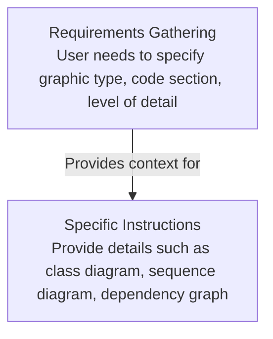

# Codebase Research Report

## Query
create grafic in the code

## Answer
### System Diagram

### Summary
I need more information to fulfill this request. Please specify:

1.  **What kind of graphic do you want to create?** (e.g., a class diagram, a sequence diagram, a dependency graph, a flowchart, etc.)
2.  **What part of the code are you interested in?** Please provide relevant file paths, module names, or a description of the functionality you want to visualize.
3.  **What level of detail do you need?** (High-level overview, detailed interactions, specific function calls, etc.)

For example, you could ask:

*   "Create a class diagram of the `User` and `UserProfile` classes in `src/models.py`."
*   "Create a sequence diagram showing the login process in the authentication module."
*   "Create a dependency graph of the modules in the `payment` directory."

Once you provide these details, I can use the appropriate tools to generate the graphic.

## Walkthrough Steps

### 1. Gathering Requirements for Code Visualization
The response indicates that more information is needed to create a graphic from the code. The user needs to specify the type of graphic (e.g., class diagram, sequence diagram), the specific code section of interest (e.g., file paths, module names), and the desired level of detail. Without this information, it's impossible to trace a specific data flow or generate a meaningful visualization.

### 2. Providing Specific Instructions for Graphic Generation
To proceed, the user should provide details such as 'Create a class diagram of the `User` and `UserProfile` classes', 'Create a sequence diagram showing the login process', or 'Create a dependency graph of the modules in the `payment` directory'. Once these details are provided, the appropriate tools can be used to generate the requested graphic, showing the data flow or relationships within the specified code.

---
*Generated by [CodeViz.ai](https://codeviz.ai) on 6/17/2025, 5:37:36 PM*
